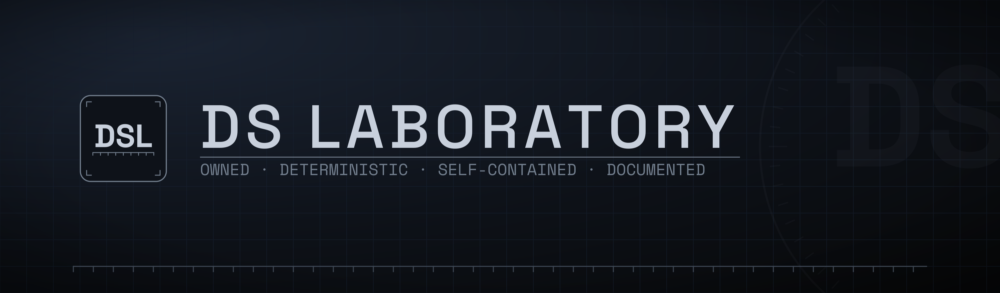

  

<em>A small laboratory for games built from first principles.</em>

---

DS Laboratory is a workshop, not a factory. One bench, one method, one standard — and work that is *built* rather than assembled. We make games the slow way: from the ground up, with tools we own, so that nothing about how a game feels is decided by something off the shelf.

### What we hold to

- **Owned, all the way down.** Every game runs on an engine we wrote ourselves, with zero runtime dependencies. If it ships, we built it.
- **Deterministic.** The simulation advances on a fixed clock — the same input gives the same result, every time. A session is a tape you can replay, exactly. We call that discipline *lockstep*, and it runs through everything.
- **Self-contained.** No accounts, no sign-ups, no ads. A game is its own code, served to your browser — nothing to install, no one to log in to.
- **Documented.** Every part explains why it exists. If we can't put the idea into words, it isn't ready to be a game.

These aren't features. They're a position — that software can be made deliberately, by hand, and meant to last.

### How the lab works

A laboratory is run by one person who sets the intention, the method, and the bar; the bench carries it out. That is how this studio works. The ideas, the decisions, the standards and the testing are one person's; much of the execution is done by AI working under that direction. We'd rather say so plainly than pretend otherwise.

---

Built in lockstep.&nbsp;&nbsp;·&nbsp;&nbsp;MMXXVI

